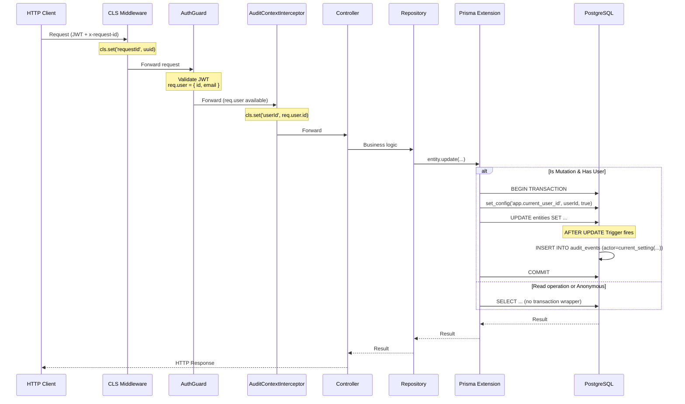

# Audit Log System

> **Enterprise-Grade Non-Repudiation & Complete Audit Trail**
>
> Atlas implements a **database-level audit system** that captures **100% of data modifications** — including direct SQL changes, migrations, and admin scripts. Built for **DORA**, **CRA**, and **CIA** compliance requirements.

## Why Atlas for Regulated Industries?

| Requirement | How Atlas Delivers |
| --- | --- |
| **Non-Repudiation** | Every change is cryptographically tied to the authenticated user via JWT. Users cannot deny actions they performed. |
| **Complete Coverage** | PostgreSQL triggers fire on ALL changes — application, direct SQL, migrations. Nothing escapes the audit log. |
| **Tamper Evidence** | Append-only audit table with no UPDATE/DELETE permissions. Any tampering attempt is immediately visible. |
| **Request Tracing** | Every audit event includes a `requestId` for end-to-end correlation across distributed systems. |
| **Source Attribution** | System distinguishes between `application` changes (user-initiated) and `direct_sql` changes (admin/migration). |
| **Immutable Snapshots** | Full `before` and `after` JSON snapshots enable complete reconstruction of data state at any point in time. |

### Compliance Ready

- ✅ **DORA** (Digital Operational Resilience Act) — Full audit trail for ICT risk management
- ✅ **CRA** (Cyber Resilience Act) — Evidence of security-by-design implementation
- ✅ **SOC 2 Type II** — Demonstrable change management controls
- ✅ **ISO 27001** — Information security audit requirements
- ✅ **GDPR Art. 30** — Records of processing activities

---

## Overview

The audit system captures:

- **Who** made the change (user ID from verified JWT)
- **What** was changed (entity/relation + before/after snapshots)
- **When** the change occurred (database timestamp)
- **How** it was triggered (application vs direct SQL)
- **Request context** (request ID for distributed tracing)

## Architecture



## Key Components

### 1. CLS Middleware (`app.module.ts`)

Configured via `ClsModule.forRoot()`. Sets up AsyncLocalStorage context for each request:

```typescript
ClsModule.forRoot({
  global: true,
  middleware: {
    mount: true,
    setup: (cls, req) => {
      const requestId = req.headers['x-request-id'] ?? randomUUID();
      cls.set('requestId', requestId);
    }
  },
})
```

**Why here?** `requestId` comes from HTTP header and is available immediately.

### 2. AuditContextInterceptor (`common/interceptors/`)

Global interceptor that captures authenticated user ID:

```typescript
@Injectable()
export class AuditContextInterceptor implements NestInterceptor {
  constructor(private readonly cls: ClsService) {}

  intercept(context: ExecutionContext, next: CallHandler) {
    const request = context.switchToHttp().getRequest();
    const user = request.user;

    this.cls.set('userId', user?.id ?? 'anonymous');

    return next.handle();
  }
}
```

**Why interceptor, not middleware?** Interceptors run AFTER Guards. `req.user` is only available after `AuthGuard` validates the JWT.

### 3. Prisma Extension (`database/prisma.module.ts`)

Factory-based provider that wraps PrismaClient with audit context injection:

```typescript
return client.$extends({
  query: {
    $allModels: {
      async $allOperations({ model, operation, args, query }) {
        const userId = cls.get('userId');
        const requestId = cls.get('requestId');

        // Only wrap mutations
        const isMutation = ['create', 'update', 'delete', ...].includes(operation);
        if (!isMutation || !userId) return query(args);

        // Interactive transaction ensures same connection
        return client.$transaction(async (tx) => {
          await tx.$executeRaw`SELECT set_config('app.current_user_id', ${userId}, true)`;
          await tx.$executeRaw`SELECT set_config('app.request_id', ${requestId}, true)`;

          // Execute on transaction client
          return (tx as any)[modelName][operation](args);
        });
      }
    }
  }
});
```

**Key design decisions:**

1. **Interactive Transaction** - Ensures `set_config()` and the actual query use the same database connection (critical for connection pooling).

2. **`is_local = true`** - PostgreSQL session variables are scoped to the transaction, automatically cleaned up after commit.

3. **Nested Transaction Fallback** - If code is already in a transaction, the extension catches the "Nested transactions not supported" error and executes directly.

### 4. PostgreSQL Triggers (`migrations/..._audit_triggers/`)

AFTER triggers on audited tables that read session context:

```sql
CREATE OR REPLACE FUNCTION audit_entity_changes()
RETURNS TRIGGER AS $$
DECLARE
  v_actor TEXT;
  v_source TEXT;
BEGIN
  v_actor := current_setting('app.current_user_id', true);

  IF v_actor IS NULL OR v_actor = '' THEN
    v_actor := 'db:' || current_user;
    v_source := 'direct_sql';
  ELSE
    v_source := 'application';
  END IF;

  INSERT INTO audit_events (...) VALUES (...);
  RETURN COALESCE(NEW, OLD);
END;
$$ LANGUAGE plpgsql;
```

**Source detection:** If `app.current_user_id` is not set, it means the change came from direct SQL (migrations, admin scripts), not the application.

## Audited Tables

| Table | Object Kind | Trigger Function |
| --- | --- | --- |
| `entities` | `entity` | `audit_entity_changes()` |
| `relations` | `relation` | `audit_relation_changes()` |
| `users` | `user` | `audit_user_changes()` |
| `entity_definitions` | `schema_entity` | `audit_entity_definition_changes()` |
| `relation_definitions` | `schema_relation` | `audit_relation_definition_changes()` |
| `type_definitions` | `schema_type` | `audit_type_definition_changes()` |
| `ui_entity_config` | `ui_config` | `audit_ui_entity_config_changes()` |
| `ui_global_config` | `ui_config` | `audit_ui_global_config_changes()` |

**Excluded from audit (by design):**

- `audit_events` — Auditing the audit log would cause infinite recursion
- `password_reset_tokens` — Ephemeral security tokens, auto-expire
- `email_verification_tokens` — Ephemeral security tokens, auto-expire

## Audit Event Schema

```prisma
model AuditEvent {
  id         String   @id @default(uuid())
  occurredAt DateTime @default(now())
  actor      String?                    // User ID or 'db:username'
  action     String                     // 'insert', 'update', 'delete'
  objectKind String                     // 'entity', 'relation', 'schema_*'
  objectId   String                     // UUID of affected record
  objectType String                     // Entity type or relation type
  before     Json?                      // Previous state (update/delete)
  after      Json?                      // New state (insert/update)
  requestId  String?                    // HTTP request correlation ID
  source     String?                    // 'application' or 'direct_sql'
}
```

## Security Considerations

1. **Transaction-scoped variables** - Using `set_config(..., true)` ensures variables are automatically cleared when transaction ends, preventing leakage to other requests in the connection pool.

2. **Fallback to DB user** - Direct SQL changes are still audited with the PostgreSQL role name (`db:atlas`).

3. **Append-only log** - Audit events table has no UPDATE or DELETE permissions for the application user (only INSERT and SELECT).

4. **Sensitive Data Scrubbing** - Fields like `password_hash` in the `users` table are automatically removed from the `before` and `after` snapshots to prevent credential leakage in the logs.

## Querying Audit Logs

```sql
-- All changes by a specific user
SELECT * FROM audit_events
WHERE actor = 'e7eefd5d-6656-4e32-8ca0-28cc1b122cf3'
ORDER BY occurred_at DESC;

-- All changes to a specific entity
SELECT * FROM audit_events
WHERE object_kind = 'entity' AND object_id = '...'
ORDER BY occurred_at DESC;

-- Detect direct SQL modifications
SELECT * FROM audit_events
WHERE source = 'direct_sql'
ORDER BY occurred_at DESC;
```

## Extending the System

To add audit logging to a new table:

1. Create a trigger function in a new migration:

   ```sql
   CREATE OR REPLACE FUNCTION audit_new_table_changes() ...
   CREATE TRIGGER audit_new_table_trigger
   AFTER INSERT OR UPDATE OR DELETE ON new_table
   FOR EACH ROW EXECUTE FUNCTION audit_new_table_changes();
   ```

2. No code changes needed - the Prisma Extension automatically handles context injection for all models.
